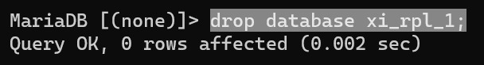
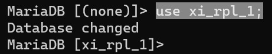
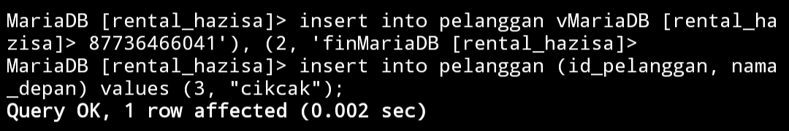

# Instalasi MySQL
## menggunakan termux
1. Buka termux
2. Ketik ``termux-setup-storage``
3. Klik izinkan/allow access 
4. Lakukan update dan upgrade paket.ketik ``pkg update && upgrade``
5. Jika ada konfirmasi untuk melanjutkan instalasi ketik aja ``Y``
6. Install aplikasi mariadb dengan mengetik``pkg install mariadb``
7. Ketika proses nya berhenti dan ada pilihan ketik saja ``Y`` untuk melanjutkan proses penginstalannya. 
8. Ketik ``mysqld_safe`` untuk memberi keamanan
9. Untuk menghentikan proses ``ctrl+z``
10. Masuk ke akun admin ``mysql -u root`` 
11. Buatlah data base dengan ketik ``create database xi_rpl_1;``
12. Kalo mau menampilkan data basenya ketik ``show databases;``
13. Kalo mau menghapus data basenya ketik ``drop database [nama database];
14. Kalo mau menggunakan data basenya ketik ``use [nama database];``

## referensi youtube
https://youtu.be/JojQd-l7fEE?si=OPIB01q45A2FmY1x
# penggunaan awal MySQL
## Query
``<mysql -u root -p>``
## Hasil


## Analisis kesimpulan
- `<mySQL>` Salah satu aplikasi database server dengan bahasa pemrograman structured query languange `(SQL)` yang berfungsi untuk mengelola data secara terstruktur dan sistematis.
- `<-u root>` Bagian ini mengeset pengguna (user) yang akan digunakan saat terhubung ke server  MYSQL. Dalam contoh ini, pengguna yang digunakan adalah `"root"`. Pengguna `"root"` biasanya memiliki hak akses penuh ke server MYSQL dan dapat melakukan tindakan administratif.
- `<-p>` Opsi ini digunakan untuk meminta kata sandi (password) setelah perintah dijalankan ini adalah langkah keamanan yang umum digunakan untuk memastikan hanya pengguna yang sah yang dapat mengakses server MYSQL. Setelah kita menekan Enter setelah perintah ini, kita akan diminta memasukkan kata sandi untuk pengguna `"root"`.


# data base
Database (basis data) adalah kumpulan terstruktur dari informasi yang disimpan secara elektronik dalam sistem komputer. Database dirancang untuk menyimpan, mengatur, dan mengelola data dengan cara yang efisien dan dapat diakses.
## buat data base
- `CREATE DATABASE` adalah perintah untuk membuat database baru.
- ``[XI_RPL_1]`` adalah nama yang Anda pilih untuk database baru Anda. Tanda kurung siku `<("[]")>` digunakan di sini untuk menghindari kesalahan jika nama database mengandung karakter spesial atau spasi. Namun, perlu dicatat bahwa tidak semua DBMS mengizinkan penggunaan tanda kurung siku dalam nama database, jadi pastikan untuk menyesuaikan sintaks dengan DBMS yang Anda gunakan.
### Query
``create database xi_rpl_1;``

### Hasil:


## Tampilkan data base
`SHOW DATABASE` digunakan untuk menampilkan daftar database yang ada dalam sistem manejemen basis data (DBMS). Perintah ini dapat digunakan di beberapa DBMS seperti MYSQL, PostgreSQL, dan beberapa DBMS lainnya. Namun, perintahnya dapat sedikit berbeda tergantung
### Query 
``show databases;``

### Hasil:

## hapus database
``<DROP DATABASE [nama_database]>`` digunakan dalam sistem manajemen basis data (DBMS) untuk menghapus sebuah database beserta semua objek yang terkait dengan database tersebut, seperti tabel, indeks, tampilan, prosedur tersimpan, dan lain-lain.
### Query
``drop database xi_rpl_1``
### Hasil:


## gunakan data base
``USE [nama_database]`` digunakan dalam sistem manajemen basis data (DBMS) untuk beralih atau memilih database yang akan digunakan. Ketika Anda menggunakan perintah ``<USE>`` diikuti dengan nama database, DBMS akan mengarahkan semua perintah dan operasi selanjutnya pada database yang ditentukan.
### Query
`` use xi_rpl_1; ``
### Hasil:


# tipe data
## angka
- Tipe data ini digunakan untuk merepresentasikan bilangan bulat tanpa bagian desimal.
- Contoh: 0, 42, -10
## teks
- Tipe data ini digunakan untuk merepresentasikan bilangan dengan bagian desimal.
- Contoh: 3.14, 2.5, -0.5
## tanggal
- `Date` digunakan untuk menyimpan informasi tentang tanggal, biasanya terdiri dari hari, bulan, dan tahun seperti 30 Januari 2024
- `Time` digunakan untuk menyimpan informasi tentang waktu dalam sehari, biasanya terdiri dari jam, menit, detik, dan milidetik seperti 14:30:45.500
- `DateTime` menggabungkan informasi tanggal dan waktu dalam satu objek, biasanya terdiri dari hari, bulan, tahun, jam, menit, detik, dan milidetik seperti 30 Januari 2024 14:30:45.500
## boolean

- Tipe data ini hanya memiliki dua nilai yang mungkin, yaitu `true` (benar) dan `false` (salah).
- Contoh: true, false
## TIPE DATA PILIHAN
### ENUM
Menyimpan satu nilai dari daftar yang telah ditentukan sebelumnya. Setiap nilai ENUM memiliki indeks numerik yang terkait, dan nilai yang disimpan dalam tabel adalah indeks tersebut.
### SET 
Menyimpan satu set nilai dari daftar yang telah ditentukan sebelumnya. Nilai-nilai dalam SET diurutkan sesuai dengan urutan deklarasinya.
# Table
## Buat Table

### Analisis Kesimpulan
Perintah `"CREATE TABLE"` digunakan dalam SQL untuk membuat sebuah tabel baru dalam basis data. Berikut adalah penjelasan mengenai sintaks dan bagaimana menggunakan perintah `"CREATE TABLE"`.

### Query
`create table [nama yang diinginkan]`

### Hasil


#### Analisis
1. create table pelanggan adalah kode yang digunakan untuk membuat tabel baru dan pelanggan adalah nama tabel nya
2. id_pelanggan, nama_depan, nama_belakang, no_telponmerupakan judul kolom
3. int(4)merupakan tipe data angka dan 4 adalah jumlah input maksimal
4. varchar(25)merupakan tipe data yang menyimpan string karakter dengan panjang variabel (variable-length) maksimal n dan 25 adalah jumlah maksimal inputan
5. char(12)merupakan tipe data yang menyimpan string karakter tetap (fixed-length) dengan panjang n dan 12 adalah jumlah maksimal inputan
6. primary keysebagai identitas yang untuk membedakan setiap baris yang ada di dalam suatu tabel
7. unique untuk memastikan bahwa setiap baris data yang terdapat dalam suatu tabel bersifat unik (tidak sama)


>[! faq]- SUMMARY 
> Kesimpulannya adalah ketika kita ingin membuat tabel kalian bisa menggunakan struktur query CREATE TABLE [nama_table] (nama_kolom1 tipe_data(ukuran) [tipe_constraint], nama_kolom2 tipe_data(ukuran) [tipe_constraint], nama_kolom3 tipe_data(ukuran) [tipe_constraint] );

## QnA
>[! Faq]- Mengapa hanya kolom id_pelanggan yang menggunakan constraint PRIMARY KEY?
>  Untuk membedakan id Pelanggan  yang sama, mencegah duplikasi, dan mempermudah pencarian data.


>[! Faq]- Mengapa pada kolom no_telp yang menggunakan tipe data chat bukan varchar?
>  Tipe data char menyimpan data dalam karakter panjang lebih efisien. pencarian pada kolom tipe data `CHAR` dapat lebih cepat


> [! Faq]- Mengapa hanya kolom no_telp yang menggunakan constraint UNIQUE?
> Karna no_telp tidak ada yang sama semua pasti berbeda dan nilainya unik maka menggunakan constrains unique artinya data dalam tabel id_telpon berbeda tidak ada yang sama. 


> [! Faq]- Mengapa kolom no_telp tidak memakai constraint NOT NULL, sementara kolom lainnya menggunakan constraint tersebut?
>  Nomor telpon dianggap opsional. nomor telepon hanya menjadi wajib saat pengguna melakukan langkah-langkah tertentu, Anda mungkin tidak ingin mengharuskan pengguna mengisinya pada tahap awal.


> [! Faq]- Perbedaan PK & UNIQUE
> PRIMERY KEY untuk membedakan data yang sama dan hanya boleh 1 dan tidak boleh tidak ada. 
Kalau UNiQUE sebuah kolom yang memiliki data yang berbeda atau tidak sama unique boleh 1,2,3 Dan seterusnya dan boleh tidak ada.


# insert
## insert 1 data
### Struktur
Insert into ``[nama table]`` 
Vallies(nilai1, nilai2, nilai3);

### struktur
```mySQL
Insert into pelanggan
Values(1,hasiza,chica,087736466041)
```
### Contoh
```MySQL
MariaDB [rental_cica]> insert into PELANGGAN
    -> VALUES(813,"HASIZA","CHICA","087736466041");
```

### Hasil


###  analisis
1. `insert into` adalah query yang digunakan untuk menginput isi table
2. `pelanggan` adalah nama table nya
3. `values` adalah query yang digunakan untuk memasukkan nilai ke kolom
4. `(1, 'hasiza','087736466041')` nilai yang ingin di masukkan ke kolom
5. `;` penutup query

> [!Summary] Kesimpulan
> Jika ingin memasukkan sebuah nilai ke dalam tabel maka kalian bisa menggunakan query `insert into [nama_table] values(nilai1, nilai2, nilai3);`
> 

## Insert >1 Data
### Contoh
```mysql
Insert into pelanggan
Value (2,chica,087736466041), (2,pinpin,087678866997)
```

---
## Menyebut kolom
### struktur
```Mysql
Insert into pelanggan
(Nama_depan, id)value
("Stuwja",6);
```

# select
## Klausa WHERE 
### Struktur
```mysql
select [nama_kolom] form pelanggan [nama_table] where[kondisi];
```

### Contoh
```mysql
select id_pelanggan, nama_depan from pelanggan where id_pelanggan=2;
```

### Analisis
1. `select` merupakan query yang digunakan untuk menampilkan hasil `insert` 
2. `id_pelanggan, nama_depan` adalah nama kolom yang akan di tampilkan
3. `from` adalah penanda yang digunakan untuk menandakan table mana yang akan di tampilkan
4. `pelanggan` adalah nama table yang akan di tampilkan
5. `where` adalah query yang digunakan untuk memberikan sebuah kondisi 
6. `id_pelanggan=2` adalah sebuah kondisi yang telah di berikan

> [!summary]
> jika ingin menampilkan baris yaitu dengan query yang dengan struktur `select [nama_kolom] form pelanggan [nama_table] where[kondisi];`
# Update 

## Struktur
```mysql
update nama_table set nama_kolom where kondisi;
```

## Contoh

```mysql
update pelanggan set no_telpon="087736466041" where id_pelanggan="1";
``` 

## Analisis
1. `update` adalah query yang digunakan untuk memperbarui nilai dari kolom
2. `pelanggan` nama table yang akan di perbarui nilai kolomnya
3. `set` query yang digunakan untuk memberikan penanda bahwa yang nilainya akan di rubah 
4. `no_telpon` kolom yang akan di ubah nilai nya
5. `"087736466041"` nilai yang akan dimasukkan 
6. `where` query yang digunakan untuk memberikan sebuah kondisi

# Delete

## Struktur

```mysql
delete from nama_table where kondisi;
```

## Contoh

```mysql
delete from pelanggan where id_pelanggan=5;
```
**Penjelasan**:

- `DELETE FROM`: adalah perintah yang menandakan bahwa kita ingin menghapus baris atau data dari sebuah tabel.
- `Pelanggan`: adalah nama tabel yang ingin kita hapus datanya.
- `WHERE`: adalah perintah yang digunakan untuk memberikan kondisi untuk memilih baris yang akan dihapus.
- `id_pelanggan = 3`: adalah kondisi yang diberikan dalam perintah `"WHERE"`. Seperti ingin menghapus baris-baris di mana nilai kolom `"id_pelanggan" sama dengan 3`. **Kesimpulan** Perintah `DELETE FROM Pelanggan WHERE id_pelanggan = 3` digunakan untuk menghapus baris-baris dari tabel `Pelanggan` di mana nilai kolom `id_pelanggan" sama dengan 3`.

# Drop Table

## Struktur 
```mysql
Drop table [nama_table];
```

## Contoh
```mysql
drop table pelanggan;
```

# TUGAS 
TAMPILKAN JUMLAH DATA MOBIL DAN KELOMPOKKAN BESERTA WARNANYA

```MYSQL
SELECT 'WARNA',COUNT(ID_MOBIL) AS JUMLAH_MOBIL FROM 'DAFTAR'
```


