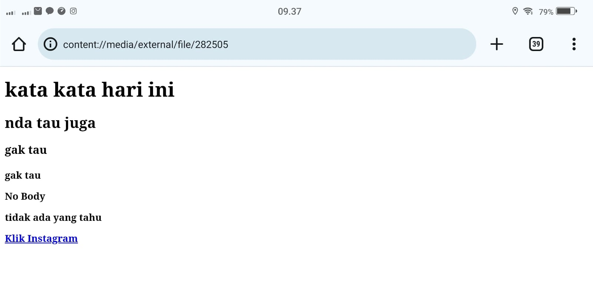

# Struktur Dasar HTML 
### Contoh Program
```html
<!DOCTYPE html>
<html>
  <head>
    <title>ini adalah Instagram</title>
  </head>
  
  <body>
    <p>ini adalah Instagram yang ditampilkan di browser</p>
  </body>
</html>
```
### Contoh Tampilan di Browser


- Tag `<!DOCTYPE html>` memberitahukan web browser bahwa dokumen HTML adalah versi 5.
- Tag pembuka `<html>` menandai awal sebuah dokumen HTML sampai dengan tag penutup `</html>`.
- Tag pembuka `<head>` berisi informasi tentang halaman HTML sampai dengan tag penutup `</head>`, biasanya dalam tag head terdapat tag `<title>` untuk memberikan informasi judul halaman HTML.
- apapun tag yang berada di antara tag pembuka `<body>` sampai dengan tag penutup `</body>` akan tampil di web browser.
# Anatomi Elemen HTML
### Contoh Program
```html
<a href="https://www.instagram.com">Klik Instagram!</a
```
### Contoh Tampilan di Browser

- Tag pembuka `<a>` tag yang menandakan awalan dan `</a>` akhir URL/link.
-  atribut `href` digunakan untuk menentukan halaman web URL/link. Contoh nilai atribut https://www.Instagram.com.
- isi konten itu untuk masuk ke URL/link yang sudah kita buat di atribut `href` yaitu "klik Instagram"
### Tag Pembuka dan Tag Penutup
Tag pembuka dan tag penutup adalah dua bagian dari suatu elemen dalam HTML yang digunakan untuk menentukan awal dan akhir dari elemen tersebut. Tag pembuka dimulai dengan nama elemen yang diapit oleh tanda kurung sudut (`<` dan `>`). Tag penutup serupa dengan tag pembuka, tetapi memiliki karakter garis miring tambahan (`/`) sebelum nama elemennya. contoh ini,`<p>`adalah tag pembuka, dan`</p>`adalah tag penutup
### Atribut Tag
Atribut tag merujuk pada informasi tambahan yang diberikan kepada elemen HTML untuk memberikan rincian atau pengaturan tertentu. Atribut dapat ditambahkan ke sebagian besar tag HTML dan berfungsi untuk mengontrol perilaku atau tampilan elemen tersebut. Contohnya, pada tag `<a>` (hipertaut), atribut `href` digunakan untuk menentukan URL tujuan. Begitu juga, pada tag ``(gambar), atribut `src` menunjukkan sumber gambar. 
### Isi/Konten Tag
Isi atau konten tag merujuk pada teks, elemen, atau informasi yang ditempatkan di antara tag pembuka dan tag penutup dalam markup HTML. Contoh sederhana adalah tag paragraf `<p>`, di mana isi tag tersebut adalah teks yang ingin dimuat dalam paragraf. Contoh "Ini adalah contoh isi atau konten dalam tag paragraf." adalah isi atau konten yang akan ditampilkan atau diinterpretasikan oleh browser web ketika halaman HTML di-render.
# Tag Dasar
## Heading
### Contoh Program
```html
<!DOCTYPE html>
<html>
  <head>
    <title>ini adalah Instagram</title>
  </head>
  
  <body>
    <h1>kata kata hari ini</h1>
    <h2>nda tau juga</h2>
    <h3>gak tau</h3>
    <h4>gak tau</h>
    <h5>gak tau</h5>
    <h6>gak tau</h6>
    <p>No Body</p>
    <p>tidak ada yang tahu</p>
    <a href="https://www.Instagram.com">Klik Instagram</a>
  </body>
</html>
```
### Contoh Tampilan di Browser 

- Tag `<h1>` Digunakan untuk judul utama atau level judul tertinggi
- Tag `<h2>` Menunjukkan tingkatan judul yang lebih rendah dari `<h1>` atau subjudul
- Tag `<h3>` Menunjukkan tingkatan judul yang lebih rendah atau subjudul dari `<h2>`
- Tag `<h4>` Menunjukkan tingkatan judul yang lebih rendah atau subjudul dari `<h3>`
- Tag `<h5>` Menunjukkan tingkatan judul yang lebih rendah atau subjudul dari `<h4>`
- Tag `<h6>` Menunjukkan tingkatan judul yang lebih rendah atau subjudul dari `<h5>` 
## Paragraf
### Contoh Program
```html
<!DOCTYPE html>
<html>
  <head>
    <title>ini adalah judul</title>
  </head>
  
  <body>
    <p>nama saya</p>
    <br>
    <p><b>kelas saya</b></p>
    <hr>
    <p><u>No Body</u></p>
    <p><i>tidak ada yang tahu</i></p>
    <a href="https://www.Instagram.com">Klik Instagram</a>
  </body>
</html>
```
### Contoh Tampilan di Browser 
![[aset3.jpeg]]
- Tag `<p>`digunakan untuk menandai paragraf pada halaman web dan di akhiri `</p>`. Ini memberikan jarak antara paragraf.
- Tag `<b>` digunakan untuk membuat teks menjadi tebal (bold) dan di akhiri `</b>`.
- Tag `<u>` digunakan untuk memberi garis bawah pada teks dan di akhiri `</u>`. 
- Tag `<i>` digunakan untuk membuat teks menjadi miring (italic) dan di akhiri `</i>`.
- Tag `<br>` digunakan untuk membuat jeda baris atau perpindahan ke baris berikutnya tanpa membuat paragraf baru.
- Tag `<hr>` digunakan untuk membuat garis horizontal, yang sering digunakan pemisah visual di antara bagian-bagian pada halaman web.
### Align

#### align left
fungsi align left digunakan untuk merapikan kata atau kalimat yang sudah diketik agar diatur "**rata kiri**".
#### align right
fungsi align right digunakan untuk mengatur posisi paragraf menjadi "**rata kanan**".
#### align center
Fungsi Align Center sebenarnya bisa dilihat dari nama fiturnya atau yang berarti **rata tengah**. Dengan mengaktifkan fitur ini, kamu bisa mendapatkan tampilan teks "**rata tengah**".
#### align justify
fungsi Align justify meregangkan baris sehingga setiap baris memiliki lebar yang sama
## Komentar
HTML juga mempunyai tag khusus untuk komentar. Untuk membuat komentar diHTML kita menggunakan awalan"
<! --" dan penutup " -- >".
>[!faq]-  komentar 
>komentar tidak akan ditampilkan pada halaman website namun programer biasanya menggunakan komentar untuk memperjelas kode program 

### Contoh Program Komentar 
```html
  <i-- ini komentar, tidak akan tampil di browser -->
  <p>ini bukan komentar, dan akan tampil di browser
```

### Contoh Tampilan di Browser 


## List
List adalah fungsi dalam HTML yang digunakan untuk menampilkan daftar dari sesuatu. Dalam HTML,Tag list terdiri dari 2 jenis`<ol>` ordered list (berurutan) dan `<ul>`unorderend list (tidak berurutan).Ordered list akan ditampilkan dengan angka atau huruf, sedangkan unordered list dengan bulatan atau kotak ataupun simbol lainnya

>[!faq]- List
> Untuk menampilkan list dalam HTML dapat menggunakan tag `<li>`...`</li>` namun perlu menyisipkan elemen `<ol>`...`</ol>`atau `<ul>`...`</ul>`kedalam elemen `<li>` tersebut untuk membuat daftar list
### Contoh Program Tidak Beraturan 
```html
<h1>peralatan XI RPL 1</h1>
<p> ialah</p
<ul>
  <li>meja</li>
  <li>sapu</li>
  <li>kipas</li>
</ul>
```
### Contoh Program Beraturan
```html
<h1>Absen XI RPL 1</h1>
<p> ialah</p>
<ol>
  <li>Adel</li>
  <li>Alya</li>
  <li>Caca</li>
  <li>Fina</li>
  <li>Hasiza</li>
</ol>
```
### Contoh Tampilan di Browser


## Link
Link dapat ditemukan di hampir semua halaman web. Link/Tautan memungkinkan sebuah teks yang ketika di-klik akan pindah ke halaman lainnya. HTML menggunakan tag `<a>` untuk keperluan ini. Link ditulis dengan `<a>` yang merupakan singkatan cari anchor

 >[!faq]- Setiap tag `<a>` setidaknya memliki sebuah atribut `<href>` , Dimana `<href>` berisi alamat yang dituju. `<href>` adalah singkatan dari hypertext reference.

Atribut penting lainnya dari tag `<a>` adalah `<target>`. Atribut target menentukan tempat untuk membuka dokumen yang ditautkan. Atribut `<target>` memiliki beberapa nilai salah satunya `<_blank>` yang berfungsi untuk membuka tautan di tab baru.

### Contoh Program 

```html
<h3>Menggunakan Tag Anchor</h3>
<a href="https://www.google.com"
target="_blank">klik disini untuk kegoogle</a><br>
<a href="halaman_lain.html">klik disini untuk kehalaman lain yang saya buat!</a>

```
### Contoh Tampilan Di Browser
![[foto6.jpeg]]

## Multimedia
### Gambar
Dalam HTML,gambar didefinisikan dengan tag ``,Tag ``adalah tag kosong, hanya berisi atribut saja,dan tidak memiliki tag penutup 

Atribut `src`setidaknya mesti ada dalam tag ini untuk menentukan URL (alamat web)dari gambar yang ingin di tampilkan 

Atribut `alt` menyediakan teks alternatif untuk gambar,jika pengguna karena beberapa alasan tidak dapat melihatnya (karena kondisi lambat, kesalahan pada atribut `src`,atau jika web browser telah disetting untuk tidak menampilkan gambar). jika browser tidak dapat menemukan gambar,maka akan muncul nilai pada atribut `alt`

Dalam tag `img`terdapat juga atribut `width`dan `height`untuk mengatur ukuran gambar,pada versi HTML standar satuan ukuran gambar adalah pixel
- misalnya dalam folder root terdapat file gambar bernama chica.jpg. Untuk menampilkan gambar tersebut kita hanya perlu mengisi nama gambar beserta jenis ekstensi file gambar kedalam atribut `src`,contohnya `src`=`"paskibra1.jpg"`
- Untuk menampilkan gambar dari internet carilah link gambar yang akan ditampilkan lalu masukkan dalam nilai atribut `src`, contohnya https://namasitus.com/paskibra1.jpg
#### Contoh Program
```html
   
```
#### Contoh Tampilan di Browser


Gambar diatas adalah contoh tampilan di web browser
![[paskibra207.jpeg]]
Gambar diatas adalah contoh dimana file gambar `paskibra1.jpg` terletak di dalam file `Folder HTML`agar programnya bisa terjalankan
### Video
Fitur HTML 5 mencakup dukungan audio dan video asli tanpa memerlukan Flash. Tag `<audio>` dan `<video>` pada HTML 5 mempermudah penambahan media ke dalam halaman web. Yang penting untuk diatur pada tag ini adalah atribut src yang berfungsi untuk mengidentifikasi sumber media. Selain itu, terdapat pula atribut controls agar pengguna dapat memutar dan menjeda media.
#### Contoh Program
```html
<video src="paskibra207.mp4"  width="300" height="200" controls>Browser anda tidak mendukung elemen <video>.   
</video>
```

#### Contoh Tempat File:
![[vidio.jpeg]]
Gambar diatas adalah contoh tempat file video tersebut disimpan.Tempat penyimpanan nya berada di file `Folder HTML`
#### Contoh Tampilan di Browser

Gambar diatas adalah contoh tampilan di Browser.

### Audio
Setiap yang telah dibahas sebelumnya bahwasanya tag `<audio>` merupakan bagian fitur HTML 5 untuk menampilkan audio asli dihalaman web tanpa memerlukan flash sebagaimana pada HTML versi 4.Yang penting untuk diatur pada tag ini adalah atribut `src` yang berfungsi untuk mengidentifikasi sumber media.Selain itu,terdapat pula atribut `controls` agar pengguna dapat memutar atau menjeda media
#### Contoh Program 
```html
<audio src="gaje.m4a" controls>
```

#### Contoh tampilan di browser:

![[foto12.jpeg]]
Gambar diatas adalah contoh tampilan di Browser.
![[audio.jpeg]]
Gambar diatas adalah contoh tempat file audio tersebut disimpan.Tempat penyimpanan nya berada di file `Folder HTML`
### Iframe
Elemen `<iframe>` dapat digunakan untuk menampilkan halaman website lain dalam suatu website. Atau menampilkan dokumen HTML lain dalam sebuah website. Mudahnya, bisa dibilang website dalam website.

 >[!faq]- Contoh penggunaannya seperti ini. Jika kita mempunyai website sekolah, lalu di website tersebut ingin menampilkan alamat dalam google maps sekolah. Agar memudahkan pengunjung website, kita bisa langsung tampilkan saja halaman sekolah yang ada di google maps.

Dalam tag `iframe` ada beberapa atribut yang penting seperti:

- `src`, untuk mencari sumber halaman html atau web yang akan ditampilkan di dalam frame
- `width` dan `height`, untuk mengatur ukuran panjang dan lebar dari frame.

#### Contoh Program
```html
<iframe src="http://smkn7makassar.sch.id/" width="1250" height="550"></iframe>
```

#### Contoh Tampilan di Browser:


## Tabel
Tabel dalam HTML didefinisikan dengan tag `<table>`.
- Setiap baris tabel didefinisikan dengan tag `<tr>.`
- Header (judul) tabel didefinisikan dengan tag `<th>`. Secara default, header tabel memiliki teks tebal dan berada di tengah.
- Data tabel/sel didefinisikan dengan tag `<td>`. Karena sel merupakan bagian terkecil dari tabel maka dari itu tag ini selalu berada di dalam tag `<tr>`.

### Contoh Program:
```html
<!DOCTYPE html>
<html>
    <head>
     <title>JUDUL HALAMAN </title>
    </head>
   <body>
       <table border="1">
       <tr>
       <th>Nama</th>
       <th>Asal Institusi</th>
       </tr>
        <tr>
       <td>Hasiza</td>
        <td>SMKN 7 Makassar</td>
        </tr>
         <tr>
        <td>Rezky Awalya </td>
        <td>SMKN 7 Makassar</td>
        </tr>
        <td>Andi Ashadelah Maharani</td>
        <td>SMKN 7 Makassar</td>
        </tr>
      <tr>
       <td>fatsa akhwani</td>
        <td>SMKN 7 Makassar</td>
        </tr>
      <tr>
       <td>nur inayah</td>
        <td>SMKN 7 Makassar</td>
        </tr>
      <tr>
       <td>nur afni Ramadhani</td>
        <td>SMKN 7 Makassar</td>
        </tr>
        </table>
    </body>
</html>
```

>[!faq]- Table
>Perhatikan bahwa pada tag `<table>` terdapat sebuah atribut border. Atribut border digunakan untuk memberikan nilai garis tepi dari tabel. Nilai ini dalam ukuran pixel. border=”1”, berarti kita mengistruksikan kepada web browser bahwa tabel tersebut akan memiliki garis tepi sebesar 1 pixel. Jika tidak ditambahkan, secara default tabel tidak memiliki garis tepi

### Contoh Tampilan di Browser:
![[foto8.jpeg]]

### Contoh Program
```html
<table border="1">
    <tr>
         <th rowspan="2">Nama</th>
       <th colspan="2">Asal Institusi</th>
    </tr>
    <tr>
       <th width="100">Sekolah</th>
       <th width="100">Kampus</th>
    </tr>
    <tr>
       <td>Hafshah</td>
       <td>SMAN 4 MAKASSAR</td>
       <td>Universitas Muslim Indonesia</td>
    </tr>
    <tr>
        <td>Nurfadillah</td>
        <td rowspan="2">SMKN 7 Makassar</td>
        <td align="center" rowspan="2">-</td>
    </tr>
    <tr>
         <td>Siti Nur Hasiza.A</td>
    </tr>
    <tr>
         <td>Muhammad Alif H</td>
         <td>SMKN 3 MAKASSAR</td>
         <td>Universitas Negeri Makassar</td>
    </tr>
</table>
      
```
tabel yang penting untuk diketahui yaitu:
- `rowspan` merupakan atribut HTML yang berfungsi untuk menggabungkan beberapa **baris (ke bawah)**.
- `colspan atau column span` merupakan atribut HTML yang berfungsi untuk menggabungkan beberapa *kolom (ke samping).*
- `width` berfungsi untuk mengatur *lebar* tabel yang nilainya didefinisikan dalam satuan pixel secara default.
- `height`  berfungsi untuk mengatur *tinggi* tabel yang nilainya didefinisikan dalam satuan pixel secara default.
- `align` berfungsi untuk mengatur *perataan teks* pada tabel. Nilai atribut yang dapat diberikan yaitu `left` untuk perataan teks ke kiri, `right` untuk perataan teks ke kanan, dan `center` untuk perataan teks ke tengah.
### Contoh Tampilan Di Browser:
![[foto9.jpeg]]

>[!faq]- Perhatikan pada konten elemen `**<td>**` yang berisi **Muhammad Alif H**, hanya terdapat satu elemen `<td>` disana. Hal ini dikarenakan konten elemen `<td>` sebelumnya yaitu SMKN 3 Makassar dan - pada data Nurfadillah mengandung atribut rowspan dengan nilai 2 yang secara otomatis mengisi data di bawahnya yakni data **Siti Nur Hasiza.A** Nilai 2 menunjukkan bahwa ada dua baris yang digabungkan menjadi satu

>[!faq]- Konsep ini juga sama dengan apa yang terjadi pada `<th` `rowspan`="2">Nama`</th>`dan `<th` `colspan`="2">Asal Institusi `</th>`

### Tabel Tugas
#### Contoh Program 
```html
<html>
<head>
<title>table</title>
</head>
<body>
<table border="1">
<tr bgcolor="green">
<th colspan="2" width="100">Nama Hari</th>
<th colspan="2" width="100">Nama Bulan</th>
</tr>
<tr height="30">
<td>Senin</td>
<td>Selasa</td>
<td>April</td>
<td rowspan="2" align="center">Juni</td>
</tr>
<tr height="30">
<td>Rabu</td>
<td>Kamis</td>
<td>Mei</td>
</tr>
</table>
</body>
</html
```
#### Contoh Tampilan di Browser
![[foto28.jpeg]]
Analisis:
Untuk tabel "Nama Hari" dan "Nama Bulan"Merupakan 2 kolom hanya tetapi di tambahkan atribut `colspan`yang akan membuat 2 kolom menjadi 1 dan begitu juga dengan kolom "Juni" yang seharusnya terdapat 2 baris tetapi karena di tambahkan atribut `rowspan`yanv membuat 2 baris menjadi 1

## Form
Elemen `<form>` HTML digunakan untuk mendefinisikan form yang digunakan untuk mengumpulkan inputan dari pengguna website. Tag ini digunakan untuk mengkoleksi inputan dari user, konsep ini sama seperti konsep formulir di dunia nyata.

>[!faq]- Form
> Dengan kata lain tag `<form>` merepresentasikan sebuah "formulir" di mana satu formulir bisa memiliki banyak kolom isian.

Form HTML berisikan elemen-elemen `form` lainnya. Elemen `<form>` digunakan untuk menampung macam-macam elemen yang berkaitan dengan sebuah `form`, seperti `text fields`, `checkbox`, `radio button`, tombol `submit`, dan banyak lagi yang dapat diedit kemudian ditulis untuk dikirim pada sebuah server untuk selanjutnya diproses guna mendapatkan informasi tertentu dari atau untuk *user*.
Umumnya, sebuah website selalu memiliki fitur form, contoh paling umum yang sering kita temui adalah seperti form login, form sign up, form komentar di suatu blog/media.

### Input

Elemen `<input>` adalah elemen form yang paling penting. Elemen `<input>` dapat ditampilkan dalam beberapa cara, tergantung pada nilai atribut type yang digunakan. Berikut adalah beberapa contoh nilai dari atribut type:

- `text` digunakan untuk mengambil isian berupa teks.Contohnya seperti nama.

- `password` digunakan untuk mengambil isian berupa kata sandi atau sesuatu yang bersifat rahasia. Tipe ini akan mengubah semua karakter yang diketikkan ke dalam karakter bulat.

- `radio` digunakan sebagai kolom isian bertipe pilihan yang menawarkan beberapa opsi kepada user namun tetapi hanya satu opsi saja yang boleh dipilih. Contohnya seperti jenis kelamin atau agama.

>[!faq]- Radio
>Perlu diperhatikan bahwa untuk penggunaan tipe `radio` yang berkategori set pilihan yang sama mengharuskan nilai `name` -nya juga sama.

Opsi default dapat dilakukan dengan menambahkan atribut checked pada elemen opsi yang dijadikan sebagai opsi default.

- `checkbox` digunakan untuk memberikan daftar pilihan dalam satu set opsi. User dapat memilih satu atau bahkan lebih dari satu pilihan pada tipe ini. Hal ini berbeda dengan tipe sebelumnya yaitu `radio` yang hanya memungkinkan user untuk memilih satu pilhan saja. Contoh penggunaan `checkbox` seperti daftar makanan kesukaan, daftar olahraga yang tidak disukai, dan yang semisalnya.

>[!faq]- Checkbox
> Perlu diperhatikan bahwa untuk penggunaan tipe `checkbox` yang berkategori set pilihan yang sama mengharuskan nilai `name` -nya juga sama.

- number digunakan untuk membatasi isian user hanya pada karakter numerik saja. Browser akan menambahkan dua buah tombol atas dan bawah untuk mengubah angka isian.

Beberapa atribut untuk tipe number:

- `min` - menentukan angka minimal
- `max` - menentukan angka maksimal
- `step` - menentukan kelipatan (nilai yang tidak sesuai kelipatan tidak bisa di-input, dan default dari atribut ini adalah `1`)

- `date` digunakan untuk memberikan isian berupa tanggal. Atribut `min` dan `max` dapat pula difungsikan pada tipe ini untuk mengatur tanggal minimal dan tanggal maksimal yang diinginkan. Nilai `min` dan `max` tersebut ditulis dengan format: `YYYY-MM-dd`

- file digunakan untuk memungkinkan pengguna memuat file. Atribut `accept` juga dapat disisipkan pada tipe ini dengan maksud untuk mengatur file apa saja yang boleh di-upload. Beberapa contoh value dari atribut `accept` yaitu:
- `accept="image/png,image/jpg, image/jpeg"` - untuk file gambar seperti `png`, `jpg`, atau `jpeg`
- `accept-".pdf" `- untuk file pdf
- `accept=".pdf"` - untuk file pdf
- `accept=".doc, .docx" `untuk file `doc` atau `docx`
- `accept=".ppt, .pptx `- untuk file `ppt` atau `pptx`

- `submit` ditampilkan dalam bentuk tombol untuk mengirim data pada `<form>` yang menjadi pembungkusnya. Atribut value digunakan untuk mengisi teks yang ingin ditampilkan pada tombol.

- `reset` berguna untuk mengembalikan state (keadaan) atau data dari suatu form ke nilai awalnya. Jika nilai awal sebuah input adalah kosong, maka ketika direset ia akan kembali kosong. Tapi jika nilai awalnya sudah terisi sesuatu, maka ketika direset datanya akan kembali seperti yang sudah diset sebelumnya.

- `button` berguna untuk membuat inputan berupa sebuah tombol. Tombol ini nantinya bisa difungsikan sesuai dengan keinginan dari pengembang web.

Untuk bacaan tentang materi ini yang dirasa cukup lengkap dan mudah dipahami, silahkan mengunjungi halaman berikut:
https://jagongoding.com/web/html/dasar/tipe-element-input/
### Label

Elemen `<label>` memiliki fungsi khusus untuk melabeli sebuah kolom inputan. Ketika screen reader membaca konten halaman HTML, lalu menemukan sebuah inputan, ia akan membaca label yang bersangkutan.

Fungsi lain dari tag `<label>` adalah ketika kita mengklik label, maka browser akan meletakkan fokus pada kolom isian yang terhubung dengannya. Syarat yang perlu diperhatikan yaitu dengan menghubungkan sebuah `<label>` dan `<input>` dengan atribut for untuk label, dan atribut id pada `<input>` dengan nilai untuk kedua atribut tersebut mesti sama persis.

### Select

Elemen `<select>` berguna dalam mendefinisikan sebuah tombol dropdown yang dimana user dapat memilih salah satu dari banyak pilihan.

>[!faq]- Select
> Elemen `<select>` nantinya berperan sebagai kontainer atau pembungkus dari elemen `<option>` yang berperan sebagai daftar pilihan atau opsi.

Elemen `<select>` hampir mirip fungsinya dengan ``<input type="radio">`` akan tetapi baiknya elemen ``<select>`` digunakan untuk memilih satu pilihan yang terdapat banyak opsi di dalamnya, sedangkan ``<input type="radio">`` lebih baiknya untuk digunakan jika user diarahkan memilih hanya satu pilihan yang opsi pilihannya tidak terlalu banyak. Contoh penggunaan elemen ini seperti memasukkan pilihan berupa asal daerah atau yang semisalnya.

Penting untuk diketahui bahwasanya opsi yang aktif secara default adalah adalah opsi yang pertama. Akan tetapi, kita bisa mengatur opsi mana yang aktif secara default dengan menambahkan atribut selected pada suatu ``<option>`` yang ingin dijadikan sebagai opsi default.

### Text Area

Elemen ``<textarea>`` berguna untuk mengambil inputan *user* berupa teks yang dapat memuat lebih dari satu baris. Jika dibandingkan dengan elemen ``<input>`` teks biasa, elemen ``<textarea>`` memiliki ukuran tinggi yang lebih besar. Element `textarea` bisa diisi lebih dari satu baris dengan menekan enter.

Atribut yang dapat digunakan untuk mengatur kuran dari `textarea` yaitu `rows` untuk jumlah baris, sedangkan atribut `cols` untuk lebarnya.

### Button

Elemen ``<button>`` yang berada di dalam sebuah form akan otomatis dianggap sama fungsinya seperti ``<input type="submit">``. Jika ingin membuat tombol biasa yang tidak men-submit ``<form>`` dapat dilakukan dengan menambahkan atribut `type="button"`.
#### Contoh Program 
```html
<h1>Formulir Pendaftaran </h1>
<form action="">
    <div>
      <label for="nama-lengkap"><b>Nama Lengkap:</b></label><br>
      <input type="text" id="nama-lengkap" name="nama_lengkap" placeholder="Masukkan nama lengkap" required>
     </div>

     <div>
       <label for="password"><b>Password:</b></label><br>
       <input type="password" id="password" name="password" placeholder="Masukkan password" required>
      </div>

      <div>
        <b>Jenis Kelamin:</b><br>
        <input id="lk" type="radio" name="jenis_kelamin" checked>
        <label for="lk">Laki-Laki</label>

        <input id="pr" type="radio" name="jenis_kelamin">
        <label for="pr">Perempuan</label>
      </div>

      <div>
        <label for="isian-usia"><b>Usia:</b></label><br>
        <input type="number" id="isian-usia" name="usia" min="17" max="25" value="17" required> Tahun
      </div>

      <div>
         <label for="tgl-ijazah"><b>Tanggal Ijazah:</b></label> <br>
         <input type="date" id="tgl-ijazah" name="tgl_ijazah" min="2021-01-01" value="2023-06-20" required>
      </div>

      <div>
         <label for="opsi-agama"><b>Agama:</b></label><br>
         <select id="opsi-agama" name="agama" required>
           <option disabled>---Pilih Agama----</option>
           <option value="islam">Islam</option>
           <option value="kristen">Kristen</option>
           <option value="katolik">Katolik</option>
           <option value="hindu">Hindu</option>
           <option value="buddha">Buddha</option>
           <option value="atheis" disabled>Atheis</option>
          </select>
       </div>

       <div>
          <label for="alamat"><b>Alamat:</b></label> <br>
          <textarea id="alamat" name="alamat" cols="25" rows="5" placeholder="Harap masukkan alamat secara lengkap" required></textarea>
       </div>

       <div>
          <b>Kemampuan Berbahasa Asing:*</b><br>
	        <input type="checkbox" id="inggris" name="bahasa_asing">
	        <label for="inggris">Inggris</label>

          <input type="checkbox" id="Indonesia" name="bahasa_asing">
          <label for="Indonesia">Indonesia</label>
                
          <input type="checkbox" id="Korea" name="bahasa_asing">
          <label for="Korea">Korea</label>
       </div>

       <div>
          <label for="isian-foto"><b>Foto 4x6:*</b></label><br>
          <input type="file" id="isian-foto" name="foto" accept="image/png,image/jpg,image/jpeg">
       </div>

       <br>
       <input type="submit" value="Kirim">
       <input type="reset" value="Batal">
       <i>*opsional (tidak wajib diisi)</i>
</form>
```

#### Contoh Tampilan di Browser
![[foto10.jpeg]]

 Beberapa atribut yang digunakan pada contoh di atas yang perlu untuk diperjelas yaitu sebagai berikut:
- `name`  digunakan sebagai nama variabel yang akan diproses oleh web server (contoh menggunakan PHP)
- `required`  digunakan untuk memastikan bahwa pengguna harus memasukkan nilai pada input tersebut sebelum dapat melakukan proses submit formulir
- `placeholder` -menuliskan teks pada elemen input. Placeholder sangat bermanfaat untuk memberikan teks bantuan kepada user untuk inputan form yang kompleks
- `value` -menentukan nilai awal dari sebuah elemen input
- `disabled` digunakan untuk menonaktifkan inputan pada elemen yang diberi atribut ini

```
<form action="/proses-pendaftaran">
...
</form>
```
<form action="/proses-pendaftaran"> </form>

Pada contoh di atas, ketika form di-submit, browser akan mengirimkan data yang ada menuju URL /`proses-pendaftaran`.
Apa yang terjadi pada URL /`proses-pendaftaran` ?

Pada URL tersebut terdapat sebuah aplikasi/program yang berjalan di server (bukan di browser). Tugas dari program tersebut adalah mengelola data yang dikirim seperti misalnya menyimpan data tersebut ke dalam sebuah database.

Bahasa yang umum digunakan di dalam server adalah python, nodejs, PHP, dan lain sebagainya.

Untuk mendapatkan gambaran lebih jelas, sebenarnya akan dijelaskan pada modul selanjutnya yang berkaitan dengan materi PHP atau juga bisa dengan membaca tutorial berikut:
https://jagongoding.com/web/php/web-dinamis/membuat-dan-menangani-form/https://jagongoding.com/web/php/web-dinamis/membuat-dan-menangani-form/

• Mempelajari elemen HTML yang lain, sebab apa yang dijelaskan sebelumnya hanyalah sebagian kecil dari elemen HTML akan tetapi elemen tersebut sangat sering digunakan.

• Mempelajari atribut-atribut baik dari elemen HTML yang telah dijelaskan maupun atribut dari elemen HTML yang lain. Sebab dengan mengetahui banyak dari atribut dari sebuah elemen maka kita dapat memodifikasi elemen tersebut dengan lebih baik.

• Pelajari pula tag semantik yang menjadi ciri khas dari HTML5, hal ini digunakan dengan maksud di antaranya untuk mengoptimalkan SEO website.

### Form Tugas
#### Contoh Program
```html
html>
    <head>
        <title>form tugas</title>
    </head>
    <body>
        <!-- for untuk mengarahkan dan harus sama dengan id -->
        <form action="">
            <div>
            <label for="nama">nama: </label>
            <input type="text" id="nama" required=""><br> <br>
            </div>

            <div>
            <label for="password">password: </label>
            <input type="password" id="password" required=""><br> <br>
            </div>

        <!-- name sebuah atribut yang berfungsi untuk bsa memilih 1-->
            <label for="jenis kelamin">jenis kelamin: </label>
            <input type="radio" name="jk" id="jenis kelamin" > 
            <label>laki-laki</label>
            <input type="radio" name="jk" id="jenis kelamin" checked> 
            <label>perempuan</label><br> <br>

            <label for="coding"> coding: </label>
            <input type="checkbox" name="web" id="coding"> web
            <input type="checkbox" name="mobile" id="coding"> mobile
            <input type="checkbox" name="desktop" id="coding"> desktop
            <br> <br>
            
            <!--value gunanya untuk tulisan ditombol, -->
            <input type="submit" value="kirim">
            <input type="reset" value="ulang"><br> <br>

            pesan anda:
            <textarea></textarea>
        </form>
    </body>
</html>
```
#### Contoh Tampilan di Browser
![[contoh2.jpeg]]
Analisis:
Untuk tabel "Nama Hari" dan "Nama Bulan"Merupakan 2 kolom hanya tetapi di tambahkan atribut `colspan`yang akan membuat 2 kolom menjadi 1 dan begitu juga dengan kolom "Juni" yang seharusnya terdapat 2 baris tetapi karena di tambahkan atribut `rowspan`yanv membuat 2 baris menjadi 1
# DIV & SPAN
## Div
`<Div>` adalah tag HTML yang digunakan untuk membuat blok konten. Tag ini digunakan untuk mengelompokkan konten dan memberikan atribut tertentu pada blok tersebut. Contoh:

```html
<!DOCTYPE html>
<html>
  <head>
    <title>DIV-SPAN</title>
  </head>
  <body>
      <!-- div digunakan untuk memblok satu area dengan tanda baris
    baru setelahnya-->
    <style> 
    .contoh{
      background aqua
    }
    </style>
    <div>ini dibuat menggunakan div</div>
    <div>ini juga menggunakan div</div>
   
  </body>
</html>

```

## Span 
`<span>` adalah tag HTML yang digunakan untuk membuat blok konten yang tidak memiliki atribut tertentu. Contoh:

```html
<!DOCTYPE html>
<html>
  <head>
    <title>DIV-SPAN</title>
  </head>
  <body>
     <!-- kebalikan <div>-->
    <style> 
    .contoh{
      background aqua
    }
    </style>
    <div>ini dibuat menggunakan div</div>
    <div>ini juga menggunakan div</div>
    
    <p>
         ini dibuat dengan tag paragraf,
        <span> dan ada span didalamnya. </span>
    </p>
    
    <span>ini dibuat menggunakan span</span>
    <span>ini juga menggunakan span</span>
    
  </body>
</html>
```

# Apa Itu Semantic HTML ?

Semantic HTML adalah konsep dalam pengembangan web yang berfungsi menyediakan makna atau arti lebih dalam kode HTML.

  

Dalam semantic HTML, masing-masing elemen memiliki nama yang mencerminkan arti dari kontennya, bukan hanya presentasinya. Semantic membantu mesin pencari dan perangkat pembaca layar (screen reader) untuk memahami struktur dan konten dari halaman web dengan lebih maksimal.

  

Artinya,  jika kamu ingin membuat kode yang mudah dipahami, tidak hanya oleh manusia tapi juga oleh mesin, semantic HTML adalah solusi yang tepat.

saya berikan contoh dari gambar berikut.


  

Mungkin kalian bertanya-tanya, “Apa perbedaan antara semantic HTML dan non-semantic HTML?”

  

Perbedaan keduanya cukup sederhana.

  

Semantic HTML menggunakan elemen yang menggambarkan arti dari konten, seperti `<article>`, `<section>`, dan `<nav>`. Sedangkan non-semantic HTML menggunakan elemen seperti `<div>` dan `<span>` yang tidak mengungkapkan informasi apa pun tentang kontennya.

  

Untuk memahami lebih jelas, mari kita lihat contoh kode berikut:

**Bukan Semantic:**

```html

<div id="header"></div>

<div id="sidebar"></div>

<div class="main">

    <div class="section">

        <div class="article">

            <div class="figure">

                

                <div class="figcaption"></div>

            </div>

        </div>

    </div>

</div>

<div id="footer"></div>

```

**Semantic HTML:**

```html

<header></header>

<main>

    <section>

        <article>

            <figure>

                

                <figcaption></figcaption>

            </figure>

        </article>

    </section>

</main>

<footer></footer>

```

# Mengapa Menulis Semantic HTML

1. Aksesibilitas

     Tag HTML yang semantik membantu membuat konten lebih mudah diakses oleh pembaca layar dan perangkat bantu lainnya. Ini meningkatkan pengalaman pengguna untuk orang dengan disabilitas.

2. SEO (Search Engine Optimization):

     Mesin pencari, seperti Google, cenderung memberikan peringkat lebih tinggi pada halaman web yang menggunakan Semantic HTML karena struktur yang jelas membantu mesin pencari memahami dan mengindeks konten dengan lebih baik.

3. Mudah Dibaca Pengembang/Developer

     Penggunaan tag yang memiliki makna membuat kode HTML lebih mudah dibaca dan dimengerti oleh pengembang dan anggota tim lainnya. Ini mempermudah pemeliharaan dan pengembangan kode.

# Jenis Jenis Tag Semantic HTML

Tag semantik dapat mendefinisikan berbagai bagian halaman web.

  

Mari kita lihat elemen semantik HTML yang paling **umum**, dibagi menjadi dua kategori berdasarkan penggunaannya:

  

- [Tag semantik HTML untuk struktur](##Tag%20Semantic%20HTML%20untuk%20struktur)

- [Tag semantik HTML untuk teks](##Tag%20Semantic%20HTML%20untuk%20teks)

## Tag Semantic HTML untuk Struktur

Banyak tag HTML semantik mengkomunikasikan tata letak halaman.

  

Tag "struktural" ini diperkenalkan ketika HTML4 ditingkatkan ke HTML5. Itulah mengapa juga dikenal sebagai tag HTML5 semantik atau elemen HTML5 semantik.

### `<header>`

Tag header mendefinisikan konten yang harus dianggap sebagai informasi pengantar halaman atau bagian

### `<nav>`

Tag navigasi digunakan untuk tautan navigasi. Tag ini dapat diletakkan di dalam tag `<header>`, namun tag navigasi sekunder `<nav>` juga biasa digunakan di tempat lain pada halaman.

### `<main>`

Tag ini berisi konten utama (juga disebut badan) halaman. Hanya boleh ada satu tag per halaman.

### `<section>`

Menggunakan `<section>` adalah cara untuk mengelompokkan konten yang berdekatan dengan tema yang sama. Tag `<section>` berbeda dengan tag artikel. Tag `<section>` tidak selalu berdiri sendiri, tetapi merupakan bagian dari sesuatu yang lain.

### `<article>`

Tag artikel mendefinisikan konten yang dapat berdiri sendiri terlepas dari halaman atau situs tempat konten tersebut berada. Ini tidak selalu berarti "posting blog". Anggap saja sebagai "sebuah artikel" - sebuah item mandiri yang dapat digunakan dalam berbagai konteks.

### `<aside>`

Elemen aside ini sering digunakan untuk bilah sisi-area yang menambahkan informasi pelengkap.

### `<footer>`

Elemen `<footer>` juga sering digunakan di bagian bawah halaman. Biasanya mencakup informasi kontak, informasi hak cipta, dan beberapa navigasi situs.

## Tag Semantic HTML untuk Teks

Tag HTML semantik untuk teks adalah tag HTML yang-selain pemformatan-juga menyampaikan fungsi semantik teks yang dikandungnya.

### `<h1 (heading)`

Tag H1 menandai judul tingkat atas. Biasanya hanya ada satu judul H1 per halaman.

### `<p> paragraf`

Paragraf teks yang berdiri sendiri.

### `<a> anchor`

Digunakan untuk menandai hyperlink dari satu halaman ke halaman lainnya.

### `<ol> daftar terurut`

Daftar item yang ditampilkan dalam urutan tertentu, dimulai dengan poin-poin. Satu tag `<li>` (item daftar) berisi satu item dalam daftar.

### `<ul> daftar tidak berurutan`

Daftar item yang tidak perlu ditampilkan dalam urutan tertentu, dimulai dengan nomor urut. Satu tag `<li>` (item daftar) berisi satu item dalam daftar.

### `<q> / <blockquote>`

Kutipan teks. Gunakan `<blockquote>` untuk kutipan panjang dengan banyak baris dan `<q>` untuk kutipan pendek dan sejajar.

### `<em>`

Digunakan untuk teks yang harus ditekankan.

### `<strong>`

Digunakan untuk teks yang harus diberi penekanan kuat.

### `<code>`

Blok kode computer.

  

> Disini saya hanya mencantumkan beberapa tag HTML semantik yang paling umum. Anda dapat menggunakan banyak lainnya seperti `<summary>`, `<time>`, `<address>`, `<video>`, dll. untuk membuat konten situs web Anda lebih mudah dipahami. Untuk menemukan lebih banyak elemen semantik HTML, lihat pada web berikut https://developer.mozilla.org/en-US/docs/Glossary/Semantics

  

# Tips & Best Practices Semantic HTML

mari kita bahas beberapa tips penerapan HTML berdasarkan kesalahan umum yang dilakukan orang saat menggunakan tag HTML semantic.

## Jangan Gunakan Tag Semantic HTML untuk Styling

Meskipun browser web menerapkan styling pada banyak tag semantik (misalnya, teks dalam tag `<a>` biasanya berwarna biru dan bergaris bawah), bukan berarti tag HTML seharusnya digunakan untuk menata gaya teks Anda.

  

Dengan kata lain, sama seperti Anda tidak akan menggunakan tag `<a>` untuk teks “non-link” hanya untuk membuatnya berwarna biru dan bergaris bawah, Anda juga tidak boleh menggunakan tag semantik lain hanya untuk tujuan gaya.

  

Berikut beberapa contoh umum penggunaan tag semantik yang salah:

  

1. Menggunakan tag `<h1>` hingga `<h6>` untuk teks yang bukan heading dengan tujuan untuk mengubah ukuran fontnya

2. Menggunakan `<blockquote>` hanya untuk membuat indentasi teks yang bukan kutipan

3. Menggunakan `<strong>` atau `<em>` hanya untuk menambahkan huruf tebal atau miring pada teks yang tidak memerlukan penekanan.

> **Untuk tujuan penataan gaya, selalu gunakan CSS.**

## Pertimbangkan Sarang Tag Heading Dengan Semantic HTML

Selalu urutkan elemen header berdasarkan kepentingannya.

  

Misalnya, semua judul H3 yang mengikuti judul H2 tertentu harus menjadi subtopik dari H2 tersebut.


Dengan cara ini, struktur judul menciptakan hierarki logis dari topik dalam konten Anda dan membantu pembaca dan mesin pencari lebih memahami dan menavigasi teks.

  

## Jangan Hanya Menyalin Tata Letak Visual Anda

Implementasi HTML Anda tidak boleh hanya menjadi duplikat tata letak visual. Sebaliknya, itu harus mengikuti struktur semantik halaman.

  

Mari kita lihat contoh ini:


Penggunaan tag HTML di sisi kiri salah karena menunjukkan bahwa halaman tersebut berisi empat topik berbeda, bukan satu topik dan tiga subtopik, seperti yang ditunjukkan di sebelah kanan.

  

Di sisi kanan, kami memiliki halaman yang dibuat dengan benar menggunakan HTML semantik. Meskipun ada empat bagian terpisah dalam tata letak visual halaman, tag HTML disusun berdasarkan semantik konten.
