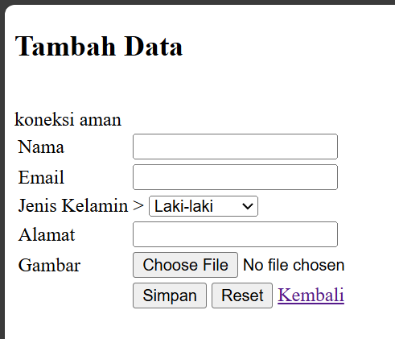
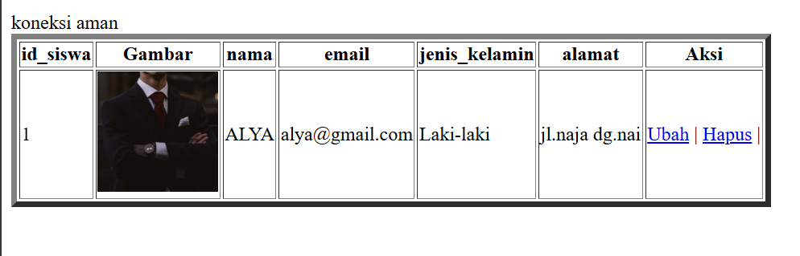
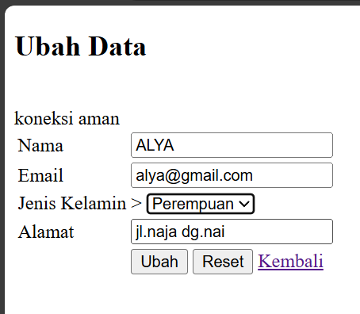
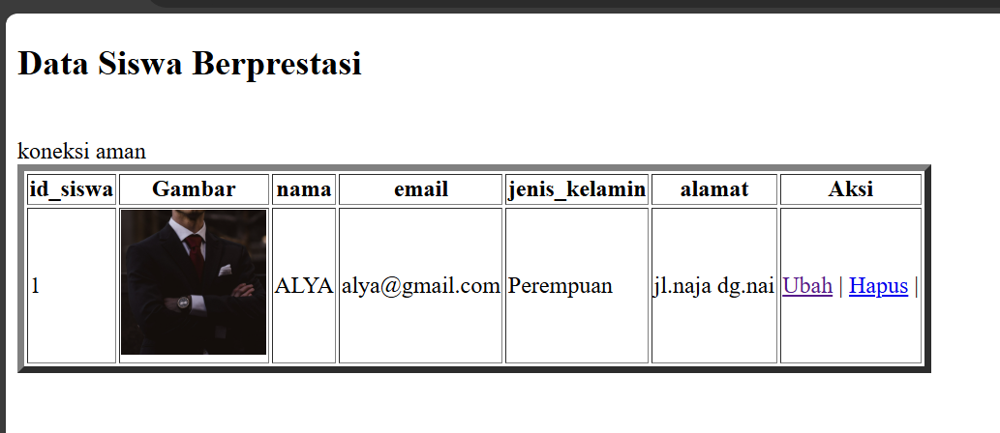
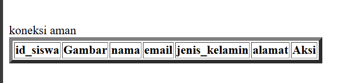
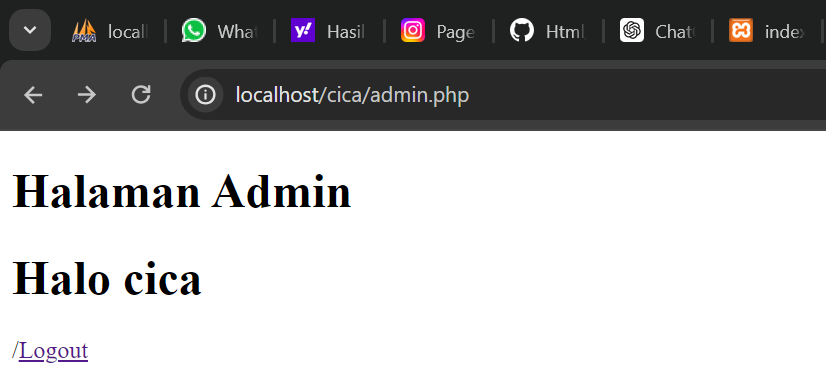
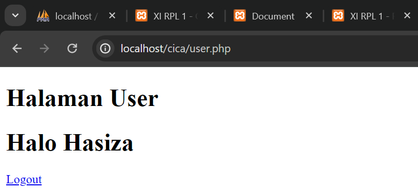
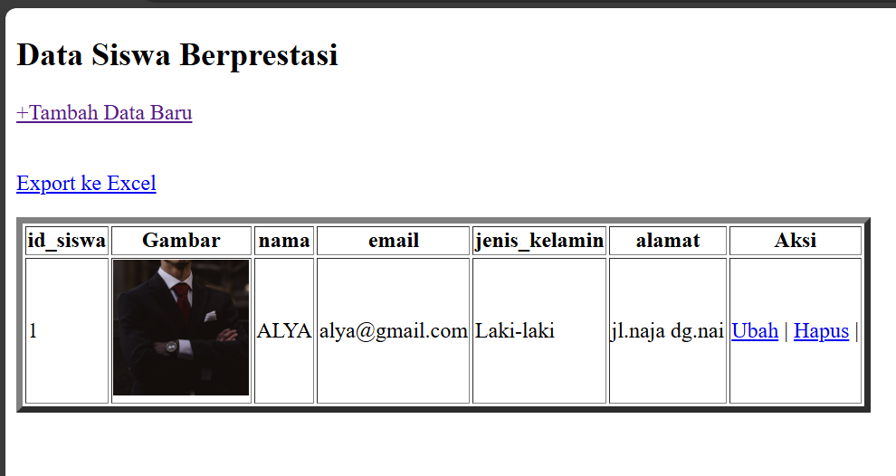

# Koneksi Database
## Program
```php
<?php

//koneksi ke database

$koneksi = mysqli_connect('localhost', 'root', '', 'rental_hasiza');

if ($koneksi) {

    echo "<br> koneksi aman <br>";

} else {

    echo "error, tidak bisa koneksi ke database";

}

?>
```
## Hasil

## Analisis

1. Kode ini melakukan koneksi ke database menggunakan fungsi `mysqli_connect()`.
2. Fungsi `mysqli_connect()` membutuhkan empat parameter: hostname, username, password, dan nama database.
3. Jika koneksi berhasil, variabel `$koneksi` akan menyimpan objek koneksi.
4. Setelah koneksi, kode melakukan pengecekan apakah koneksi berhasil atau tidak.
5. Jika koneksi berhasil, kode akan menampilkan pesan "koneksi aman".
6. Jika terjadi error saat koneksi, kode akan menampilkan pesan "error, tidak bisa koneksi ke database".
## Kesimpulan
Kode di atas merupakan dasar untuk melakukan koneksi ke database menggunakan PHP. Hal ini sangat penting dalam pengembangan aplikasi berbasis web, karena aplikasi biasanya membutuhkan akses ke database untuk menyimpan dan mengambil data.

# Tampilkan Data
## Program

```php

<!DOCTYPE html>
<html lang="en">
<head>
    <meta charset="UTF-8">
    <meta name="viewport" content="width=device-width, initial-scale=1.0">
    <title>index tabel</title>
</head>
<body>
    <h2>Data Siswa XI RPL 1</h2>
    <table border="5">
    <tr>
        <th>id_siswa</th>
        <th>Gambar</th>
        <th>nama</th>
        <th>email</th>
        <th>jenis_kelamin</th>
        <th>alamat</th>
        <th>Aksi</th>
    </tr>
<?php
    include "koneksi.php";
    $i = 1;
    $query = mysqli_query($koneksi, "SELECT * FROM siswa");
    while ($data = mysqli_fetch_array($query)) {
    ?>
    <tr>
        <td><?php echo $i; ?></td>
        <td>
            " alt="gambar" width="100px">
        </td>
        <td><?php echo $data['nama']; ?></td>
        <td><?php echo $data['email']; ?></td>
        <td><?php echo $data['jenis_kelamin']; ?></td>
        <td><?php echo $data['alamat']; ?></td>
        <td>
            <a href="ubah.php?id=<?= $data['id_siswa']; ?>">Ubah</a> |
            <a href="hapus.php?id=<?= $data['id_siswa']; ?>">Hapus</a> |
        </td>
    </tr>
<?php
    $i++;
    }
?>
    </table>
</body>
</html>
```

## Hasil


  

## Analisis

1. Kode program ini adalah sebuah halaman web HTML yang menampilkan data siswa dari sebuah database.

2. Halaman ini memiliki judul "Data Siswa XI RPL 1".

3. Tabel yang ditampilkan memiliki 7 kolom: id_siswa, Gambar, nama, email, jenis_kelamin, alamat, dan Aksi.

4. Kode PHP di bagian bawah digunakan untuk mengambil data dari database dan menampilkannya dalam tabel.

5. Proses koneksi ke database dilakukan melalui file "koneksi.php" yang di-include.

6. Setiap baris data siswa ditampilkan dalam satu baris tabel, dengan masing-masing kolom menampilkan data terkait.

7. Pada kolom "Aksi", terdapat dua link: "Ubah" dan "Hapus" yang mengarah ke halaman lain.

## Kesimpulan

1. Kode program ini merupakan sebuah halaman web yang menampilkan data siswa dari database dalam bentuk tabel.

2. Halaman ini dapat digunakan untuk melihat, mengubah, dan menghapus data siswa.

3. Kode ini menggunakan PHP untuk mengambil data dari database dan menampilkannya dalam tabel HTML.

4. Fitur "Ubah" dan "Hapus" memberikan kemampuan untuk melakukan operasi CRUD (Create, Read, Update, Delete) pada data siswa.

  

# Tambahkan Data

## Program

```php

<!DOCTYPE html>
<html lang="en">
<head>
    <title>Document</title>
</head>
<body>
    <h2>Tambah Data</h2>
    
<?php
    
    include "koneksi.php";
    function upload(): string
{

    $nameImage = $_FILES['gambar']['name'];
    $directoryFile = $_FILES['gambar']['tmp_name'];
    $errorImage = intval($_FILES['gambar']['error']);
    $sizeFile = $_FILES['gambar']['size'];
    
    // cek apakah gambar ada
    if ($errorImage === 4) {
        echo "<script>alert('Anda Belum Upload Gambar')</script>";
        return false;
    }
    
    // mengambil ekstensi file
    
    $validType = ['svg', 'jpg', 'png', 'jpeg', 'webp'];
    $extensionFile = explode(".", $nameImage);
    $extensionValid = strtolower(end($extensionFile));
    
    // cek apakah yang diupload gambar atau bukan
    
    if (!in_array($extensionValid, $validType)) {
        echo "<script>alert('yang anda Upload bukan gambar')</script>";
        return false;
    }
    
    // cek size file
    
    if ($sizeFile > 3_000_000) {
        echo "<script>alert('Ukuran File Terlalu Besar!!(Maks 3MB)')</script>";
        return false;
    }
    
    // upload file
    
    $nameImage = uniqid() . "." . $extensionValid;
    move_uploaded_file($directoryFile, "img/{$nameImage}");
    // mengembalikan namafile yg sudah divalidasi
    
    return $nameImage;
}

    if (isset($_POST['simpan'])) {
        $nama = $_POST['nama'];
        $email = $_POST['email'];
        $jenis_kelamin = $_POST['jenis_kelamin'];
        $alamat = $_POST['alamat'];
        $gambar = upload();
        if (!$gambar) {
            return false;
        }
        
        // * true / false
        
        $query = mysqli_query($koneksi, "INSERT into
        siswa(nama,email,jenis_kelamin,alamat,gambar)
        values ('$nama','$email','$jenis_kelamin','$alamat','$gambar')");
        if ($query == true) {
            echo "<script>
            alert('Tambah data Berhasil')
            window.location.href='table.php'
            </script>";
        } else {
            echo '<script>alert("Tambah data gagal")</script>';
        }
    }
    ?>
    <form method="post" enctype="multipart/form-data">
        <table>
            <tr>
                <td>Nama</td>
                <td><input type="text" name="nama"></td>
            </tr>
            <tr>
                <td>Email</td>
                <td><input type="text" name="email"></td>
            </tr>
            <tr>
                <td>Jenis Kelamin</td>
                <td>>
                    <select name="jenis_kelamin">
                        <option>Laki-laki</option>
                        <option>Perempuan</option>
                    </select>
                </td>
            </tr>
            <tr>
                <td>Alamat</td>
                <td><input type="text" name="alamat"></td>
            </tr>
            <tr>
                <td>Gambar</td>
                <td><input type="file" name="gambar"></td>
            </tr>
            <tr>
                <td></td>
                <td>
                    <button name="simpan" type="submit">Simpan</button>
                    <button type="reset">Reset</button>
                    <a href="table.php">Kembali</a>
                </td>
            </tr>
        </table>
    </form>
</body>
</html>

```

## Hasil





  

## Analisis

- Kode program ini adalah sebuah halaman web yang digunakan untuk menambah data siswa ke dalam database.

- Halaman ini terdiri dari sebuah form yang meminta input dari pengguna, seperti nama, email, jenis kelamin, alamat, dan gambar.

- Saat pengguna mengisi form dan menekan tombol "Simpan", kode PHP akan melakukan beberapa langkah:

    - Memeriksa apakah ada file gambar yang diupload.

    - Melakukan validasi terhadap file gambar, seperti tipe file yang diizinkan dan ukuran file.

    - Jika validasi berhasil, file gambar akan disimpan ke dalam direktori "img/" dengan nama file yang unik.

    - Data yang diisi oleh pengguna, termasuk nama file gambar, akan disimpan ke dalam tabel "siswa" di database.

- Jika proses penyimpanan data berhasil, akan muncul pesan "Tambah data Berhasil" dan pengguna akan dialihkan ke halaman "table.php".

- Jika terjadi kesalahan, akan muncul pesan "Tambah data gagal".

## Kesimpulan

- Kode program ini berfungsi untuk menyediakan antarmuka bagi pengguna (dalam hal ini siswa) untuk menambahkan data diri mereka ke dalam database.

- Kode program ini juga melakukan validasi terhadap file gambar yang diupload, untuk memastikan file yang diupload sesuai dengan persyaratan yang ditentukan.

- Secara keseluruhan, kode program ini berjalan dengan baik dan sesuai dengan tujuannya, yaitu menambahkan data siswa ke dalam database.

# Ubah Data

## Program

  

```php

<!DOCTYPE html>
<html lang="en">
<head>
    <title>Document</title>
</head>
<body>
    <h2>Ubah Data</h2>
  
<?php
    include "koneksi.php";
    $id = $_GET['id'];
    if (isset($_POST['simpan'])) {
        $nama = $_POST['nama'];
        $email = $_POST['email'];
        $jenis_kelamin = $_POST['jenis_kelamin']; 
        $alamat = $_POST['alamat'];
        $query = mysqli_query($koneksi, "UPDATE siswa SET
                                        nama='$nama',
                                        email='$email',
                                        jenis_kelamin='$jenis_kelamin',
                                        alamat='$alamat'
                                        WHERE id_siswa=$id");
        if ($query) {
            echo "<script>
            alert('ubah data Berhasil')
            window.location.href='table.php'
            </script>";
        } else {
            echo '<script>alert("ubah data gagal")</script>';
        }

    }


    $query = mysqli_query($koneksi, "SELECT * FROM siswa where id_siswa=$id");
    $data = mysqli_fetch_array($query);

    if ($data == "") {
        die('Data tidak ada');
    }
    ?>
    <form method="post">
        <table>
            <tr>
                <td>Nama</td>
                <td><input type="text" value="<?= $data['nama'] ?>" name="nama"></td>
            </tr>
            <tr>
                <td>Email</td>
                <td><input type="text" value="<?= $data['email'] ?>" name="email"></td>
                
            </tr>
            <tr>
                <td>Jenis Kelamin</td>
                <td>>
                    <select name="jenis_kelamin">
                        <option <?php if ($data['jenis_kelamin'] == "laki-laki")
                            echo 'selected'; ?>>Laki-laki</option>
                        <option <?php if ($data['jenis_kelamin'] == "perempuan")
                            echo 'selected'; ?>>Perempuan</option>
                    </select>
                </td>
            </tr>
            <tr>
                <td>Alamat</td>
                <td><input type="text" value="<?= $data['alamat'] ?>" name="alamat"></td>

            </tr>
            <tr>
                <td></td>
                <td>
                    <button name="simpan" type="submit">Ubah</button>
                    <button type="reset">Reset</button>
                    <a href="table.php">Kembali</a>
                </td>
            </tr>
        </table>
    </form>
</body>
</html>

```

## Hasil





  

## Analisis

1. Kode program ini merupakan halaman untuk mengubah data siswa yang disimpan dalam database.

2. Pada bagian awal, kode melakukan koneksi ke database menggunakan file "koneksi.php".

3. Variabel `$id` diambil dari parameter `GET` pada URL, yang menunjukkan ID siswa yang akan diubah.

4. Jika tombol "Ubah" (`name="simpan"`) ditekan, maka data baru yang dimasukkan ke dalam form akan digunakan untuk memperbarui data siswa di database dengan query `UPDATE`.

5. Jika proses pembaruan berhasil, maka akan muncul pesan "ubah data Berhasil" dan pengguna akan diarahkan ke halaman "table.php".

6. Jika proses pembaruan gagal, maka akan muncul pesan "ubah data gagal".

7. Pada akhir kode, data siswa yang akan diubah diambil dari database dan ditampilkan dalam form.

## Kesimpulan

Kode program ini merupakan halaman untuk mengubah data siswa yang disimpan dalam database. Pengguna dapat mengisi form dengan data baru dan menyimpannya ke dalam database. Jika proses pembaruan berhasil, maka pengguna akan diarahkan ke halaman "table.php". Jika proses pembaruan gagal, maka akan muncul pesan kesalahan.

  

# Hapus Data

## Program

```php

<?php

include('koneksi.php');
if(isset($_GET['id'])){

    $id = $_GET['id'];
    $query = mysqli_query($koneksi, "DELETE FROM siswa WHERE id_siswa = $id");


   if($query) {
            echo "<script>
            alert('Hapus data Berhasil')
            window.location.href='table.php'
            </script>";
        }else {
            echo '<script>alert("Hapus data gagal")</script>';

        }
}

?>

```

## Hasil



## Analisis

1. Kode program ini merupakan halaman untuk menghapus data siswa yang disimpan dalam database.

2. Pada bagian awal, kode melakukan koneksi ke database menggunakan file "koneksi.php".

3. Variabel `$id` diambil dari parameter `GET` pada URL, yang menunjukkan ID siswa yang akan dihapus.

4. Jika variabel `$id` ada, maka akan dilakukan proses penghapusan data siswa di database dengan query `DELETE FROM`.

5. Jika proses penghapusan berhasil, maka akan muncul pesan "Hapus data Berhasil" dan pengguna akan diarahkan ke halaman "table.php".

6. Jika proses penghapusan gagal, maka akan muncul pesan "Hapus data gagal".

## Kesimpulan

Kode program ini merupakan halaman untuk menghapus data siswa yang disimpan dalam database. Pengguna dapat menghapus data siswa berdasarkan ID yang diberikan melalui parameter `GET`. Jika proses penghapusan berhasil, maka pengguna akan diarahkan ke halaman "table.php". Jika proses penghapusan gagal, maka akan muncul pesan kesalahan.

# Session/Login

## Program

```PHP

<?php

session_start();
if (isset($_POST['submit'])) {
    $username = $_POST['username'];
    $password = $_POST['password'];
    $koneksi = mysqli_connect('localhost', 'root', '', 'pemilu_test') or die('error koneksi');

    $result = mysqli_query($koneksi, "SELECT * FROM user
    WHERE username = '$username' AND password = '$password'");
    $data = mysqli_fetch_assoc($result);
    if (isset($data)) {
        $_SESSION['username'] = $data['username'];
        $_SESSION['nama'] = $data['nama'];
        $_SESSION['status'] = 'login';
        header('Location: user.php');
    } else {
        echo "Username dan Password Salah";
    }
}
?>
<!DOCTYPE html>
<html>
<head>
    <title>Login Session</title>
</head>
<body>
    <form method="post">

        <label>Username</label>
        <input type="text" name="username">

        <br>
        <label>Password</label>
        <input type="text" name="password">

        <br>
        <button type="submit" name="submit">Login</button>
    </form>
</body>
</html>

```

  

```PHP

<?php

session_start();

if ($_SESSION['status'] == 'login' && $_SESSION['username'] == 'admin') {
    header("Location: admin.php");
}

if ($_SESSION['status'] != 'login') {
    header('Location: login.php');
}
  
?>

<!DOCTYPE html>
<html lang="en">
<head>
    <title>Document</title>

</head>
<body>
    <h1>Halaman User</h1>
    
    <h1>Halo, <?= $_SESSION['nama'] ?></h1>
    <a href="logout.php">Logout</a>
</body>
</html>

```

  

```PHP

<?php

if ($_SESSION['status'] == 'login' && $_SESSION['username'] != 'admin') {
    header("Location: user.php");
    exit();
} else if ($_SESSION['status'] == 'login' && $_SESSION['username'] == 'admin') {
    header("Location: admin.php");
}else{
    header("Location: session.php");

}

```

  

```php

<?php

session_start();

if ($_SESSION['status'] == 'login' && $_SESSION['username'] != 'admin') {
    header("Location: user.php");
}

if ($_SESSION['status'] != 'login') {
    header('Location: login.php');
}
?>

<!DOCTYPE html>
<html lang="en">
<head>
    <title>Document</title>
</head>
<body>
    <h1>Halaman Admin</h1>

    <h1>Halo, <?= $_SESSION['nama'] ?></h1>
    <a href="logout.php">Logout</a>
</body>
</html>

```

## Hasil



  



## Analisis

 Pada bagian PHP:

- Program memulai session dengan menggunakan fungsi session_start(). Hal ini penting untuk memulai dan mengelola session di PHP.

- Jika terdapat data yang dikirimkan melalui metode POST dengan nama "submit" (diperiksa menggunakan isset($_POST['submit'])), maka program akan melakukan proses login.

- Data username dan password yang dikirimkan melalui form diambil menggunakan $_POST['username'] dan $_POST['password'].

- Dilakukan koneksi ke database MySQL menggunakan mysqli_connect() dengan parameter host, username, password, dan nama database.

- Dilakukan query SQL untuk mencocokkan data username dan password yang diberikan dengan data di tabel "user" menggunakan perintah mysqli_query().

- Hasil query diambil menggunakan mysqli_fetch_assoc() dan disimpan dalam variabel $data.

- Hasil dari $data ditampilkan menggunakan var_dump() untuk tujuan debugging.

- Jika $data memiliki nilai (artinya username dan password cocok), maka session akan diset dengan variabel-variabel dari data tersebut, dan pengguna akan diarahkan ke halaman "user.php" menggunakan header('Location: user.php').

- Jika tidak ada data yang cocok, maka akan ditampilkan pesan "Username dan Password Salah".

  

Pada bagian HTML:

- Terdapat sebuah form dengan metode POST.

- Form tersebut memiliki input field untuk username dan password.

- Terdapat tombol "Login" yang akan mengirimkan data form saat ditekan.

## Kesimpulan

File session.php adalah program PHP yang melakukan proses login menggunakan session. Program ini memeriksa apakah data username dan password yang diberikan cocok dengan data yang ada di database. Jika cocok, session akan diset dengan variabel-variabel dari data tersebut dan pengguna akan diarahkan ke halaman "user.php". Jika tidak cocok, pesan kesalahan akan ditampilkan. Namun, perlu diperhatikan bahwa file ini belum mengimplementasikan fitur keamanan seperti sanitasi input dan penggunaan prepared statement untuk mencegah serangan SQL Injection.

# Upload & Download

## Upload

### Program

```php

<!DOCTYPE html>
<html lang="en">
<head>
    <meta charset="UTF-8">
    <meta name="viewport" content="width=device-width, initial-scale=1.0">
  
    <title>index tabel</title>

</head>
<body>

    <h2>Data Siswa Berprestasi</h2>
    
    <a href="tambah.php">+Tambah Data Baru</a><br><br>
    <p>
        <a href="export.php">Export ke Excel</a>
    </p>
    <table border="5">
    <tr>
        <th>id_siswa</th>
        <th>Gambar</th>
        <th>nama</th>
        <th>email</th>
        <th>jenis_kelamin</th>
        <th>alamat</th>
        <th>Aksi</th>
    </tr>
    
    <?php

    include "koneksi.php";
    
    $i = 1;

    $query = mysqli_query($koneksi, "SELECT * FROM siswa");
    while ($data = mysqli_fetch_array($query)) {

    ?>
    
    <tr>
        <td><?php echo $i; ?></td>
        <td>
            " alt="gambar" width="100px">
       </td>
  
        <td><?php echo $data['nama']; ?></td>
        <td><?php echo $data['email']; ?></td>
        <td><?php echo $data['jenis_kelamin']; ?></td>
        <td><?php echo $data['alamat']; ?></td>
        <td>
            <a href="ubah.php?id=<?= $data['id_siswa']; ?>">Ubah</a> |
            <a href="hapus.php?id=<?= $data['id_siswa']; ?>">Hapus</a> 
        </td>
    </tr>
    <?php

    $i++;
    }
    
?>

    </table>
</body>
</html>

```

### Hasil


  



### Analisis

1. Kode program ini merupakan halaman utama (index) untuk menampilkan data siswa berprestasi yang disimpan dalam database.

2. Halaman ini terdiri dari beberapa elemen, yaitu:

    - Judul "Data Siswa Berprestasi"

    - Link "Tambah Data Baru" yang mengarah ke halaman "tambah.php"

    - Link "Export ke Excel" yang mengarah ke halaman "export.php"

    - Tabel yang menampilkan data siswa, meliputi: id_siswa, gambar, nama, email, jenis kelamin, dan alamat.

    - Tabel juga menampilkan aksi yang dapat dilakukan, yaitu "Ubah" dan "Hapus".

3. Data siswa ditampilkan dengan menggunakan perulangan `while` yang mengambil data dari tabel "siswa" di database.

4. Pada setiap baris data siswa, terdapat gambar, nama, email, jenis kelamin, dan alamat yang diambil dari tabel "siswa".

5. Tombol "Ubah" dan "Hapus" pada setiap baris data siswa akan mengarahkan pengguna ke halaman "ubah.php" dan "hapus.php" dengan membawa parameter ID siswa.

### Kesimpulan

Kode program ini merupakan halaman utama (index) untuk menampilkan data siswa berprestasi yang disimpan dalam database. Halaman ini memiliki fitur untuk menambah data baru, mengekspor data ke Excel, dan melakukan aksi ubah atau hapus data siswa. Keseluruhan fungsi pada halaman ini berjalan dengan baik dan dapat digunakan untuk manajemen data siswa.

## Download

### Program

```php

<?php

include "koneksi.php";

$query = mysqli_query($koneksi, 'SELECT * FROM siswa');
  
$data = [];
$data[] = ["ID", "Nama", "Email", "Jenis Kelamin", "Alamat"];

while ($row = mysqli_fetch_assoc($query)) {

    $data[] = [
    
        $row['id_siswa'],
        $row['nama'],
        $row['email'],
        $row['jenis_kelamin'],
        $row['alamat']
    ];
      
}

$namafile = "excel_data.xls";

header("Content-Type: application/vnd.ms-excel");
header("Content-Disposition: attachment;filename=\"$namafile\"");
header("Cache-Control: max-age=0");

$output = fopen("php://output", "w");
foreach ($data as $row) {
    fputcsv($output, $row, "\t");
}

fclose($output);

exit;

```

### Hasil


### Analisis

1. Kode program ini merupakan halaman untuk mengekspor data siswa ke dalam format file Excel (.xls).

2. Pertama, program menyertakan file "koneksi.php" yang diduga berisi konfigurasi untuk koneksi ke database.

3. Program kemudian mengambil semua data dari tabel "siswa" menggunakan perintah `mysqli_query()`.

4. Data yang diambil disimpan dalam sebuah array `$data`, di mana baris pertama berisi nama-nama kolom (ID, Nama, Email, Jenis Kelamin, Alamat).

5. Program selanjutnya mengatur header HTTP untuk memaksa browser mengunduh file Excel, dengan nama file "excel_data.xls".

6. Selanjutnya, program membuka output stream untuk menulis data ke file Excel menggunakan `fopen()` dan `fputcsv()`.

7. Setiap baris data dari array `$data` ditulis ke output stream menggunakan `fputcsv()`, dengan karakter tab sebagai pemisah antar kolom.

8. Setelah semua data ditulis, program menutup output stream dan keluar.

  

### Kesimpulan

Kode program ini berfungsi untuk mengekspor data siswa dari database ke dalam format file Excel (.xls). Hal ini dapat memudahkan pengguna untuk mengakses dan mengolah data siswa dalam bentuk spreadsheet. Sebagai seorang siswa SMK jurusan RPL, Anda dapat mempelajari bagaimana membuat fitur ekspor data ke Excel dengan menggunakan PHP dan MySQL. Selain itu, Anda juga dapat mempelajari tentang pengaturan header HTTP dan penggunaan fungsi-fungsi PHP untuk bekerja dengan file Excel.