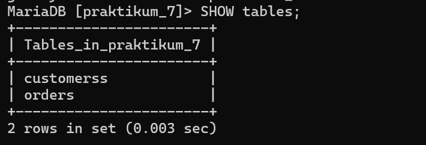
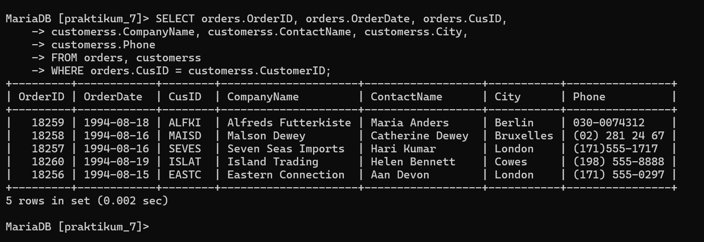
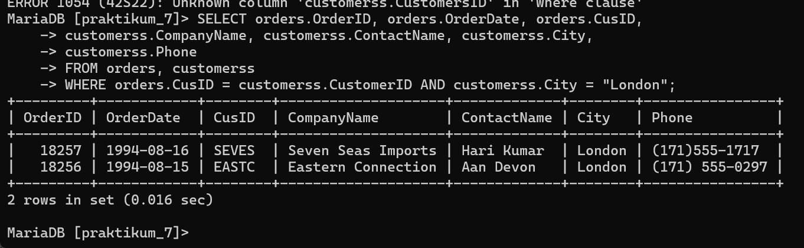

# PRAKTIKUM 7 (KLP.3)
## Query 1

```mysql
SELECT orders.OrderID, orders.OrderDate, orders.CusID,
    -> customerss.CompanyName, customerss.ContactName, customerss.City,
    -> customerss.Phone
    -> FROM orders, customerss
    -> WHERE orders.CusID = customerss.CustomerID;
```
## Hasil





## Analisis

1. **SELECT Clause**:
    
    - `orders.OrderID`: Mengambil kolom `OrderID` dari tabel `orders`.
    - `orders.OrderDate`: Mengambil kolom `OrderDate` dari tabel `orders`.
    - `orders.CusID`: Mengambil kolom `CusID` dari tabel `orders`.
    - `customerss.CompanyName`: Mengambil kolom `CompanyName` dari tabel `customerss`.
    - `customerss.ContactName`: Mengambil kolom `ContactName` dari tabel `customerss`.
    - `customerss.City`: Mengambil kolom `City` dari tabel `customerss`.
    - `customerss.Phone`: Mengambil kolom `Phone` dari tabel `customerss`.
2. **FROM Clause**:
    
    - `FROM orders, customerss`: Menentukan tabel `orders` dan `customerss` sebagai sumber data. Tabel-tabel ini akan digabungkan.
3. **WHERE Clause**:
    
    - `WHERE orders.CusID = customerss.CustomerID`: Kondisi ini memastikan bahwa hanya baris-baris di mana `CusID` dalam tabel `orders` sama dengan `CustomerID` dalam tabel `customerss` yang akan diambil. Ini mengindikasikan adanya hubungan (relasi) antara dua tabel berdasarkan kolom `CusID` dan `CustomerID`.

## Kesimpulan

1. **Jenis Join**:
    
    - Perintah ini menggunakan gaya penulisan `JOIN` yang lebih tua (old-style join) di mana tabel-tabel yang digabungkan disebutkan dalam `FROM` clause dan kondisi `JOIN` diberikan dalam `WHERE` clause. Gaya penulisan yang lebih modern dan dianjurkan adalah menggunakan explicit `JOIN` clause.
2. **Penggunaan Join**:
    
    - Perintah ini menggabungkan data dari tabel `orders` dan `customerss` berdasarkan kesamaan nilai `CusID` dari tabel `orders` dan `CustomerID` dari tabel `customerss`. Ini adalah contoh sederhana dari `INNER JOIN`.
3. **Fungsi Query**:
    
    - Query ini akan mengembalikan informasi pesanan (OrderID, OrderDate, CusID) dan informasi pelanggan terkait (CompanyName, ContactName, City, Phone) untuk setiap pesanan di mana ada kecocokan antara `CusID` di tabel `orders` dan `CustomerID` di tabel `customerss`.

## Query 2
```mysql
SELECT orders.OrderID, orders.OrderDate, orders.CusID,
    -> customerss.CompanyName, customerss.ContactName, customerss.City,
    -> customerss.Phone
    -> FROM orders, customerss
    -> WHERE orders.CusID = customerss.CustomerID AND customerss.City = "London";
```
## Hasil




## Analisis

1. **SELECT Clause**:
    
    - `orders.OrderID`: Mengambil kolom `OrderID` dari tabel `orders`.
    - `orders.OrderDate`: Mengambil kolom `OrderDate` dari tabel `orders`.
    - `orders.CusID`: Mengambil kolom `CusID` dari tabel `orders`.
    - `customerss.CompanyName`: Mengambil kolom `CompanyName` dari tabel `customerss`.
    - `customerss.ContactName`: Mengambil kolom `ContactName` dari tabel `customerss`.
    - `customerss.City`: Mengambil kolom `City` dari tabel `customerss`.
    - `customerss.Phone`: Mengambil kolom `Phone` dari tabel `customerss`.
2. **FROM Clause**:
    
    - `FROM orders, customerss`: Menentukan tabel `orders` dan `customerss` sebagai sumber data. Tabel-tabel ini akan digabungkan.
3. **WHERE Clause**:
    
    - `WHERE orders.CusID = customerss.CustomerID`: Kondisi ini memastikan bahwa hanya baris-baris di mana `CusID` dalam tabel `orders` sama dengan `CustomerID` dalam tabel `customerss` yang akan diambil.
    - `AND customerss.City = "London"`: Kondisi tambahan ini memastikan bahwa hanya baris-baris di mana `City` dalam tabel `customerss` adalah "London" yang akan diambil.

## Kesimpulan

1. **Jenis Join**:
    
    - Query ini menggunakan gaya penulisan `JOIN` yang lebih tua (old-style join) di mana tabel-tabel yang digabungkan disebutkan dalam `FROM` clause dan kondisi `JOIN` diberikan dalam `WHERE` clause. Gaya penulisan yang lebih modern dan dianjurkan adalah menggunakan explicit `JOIN` clause.
2. **Penggunaan Join**:
    
    - Perintah ini menggabungkan data dari tabel `orders` dan `customerss` berdasarkan kesamaan nilai `CusID` dari tabel `orders` dan `CustomerID` dari tabel `customerss`. Ini adalah contoh sederhana dari `INNER JOIN`.
3. **Fungsi Query**:
    
    - Query ini akan mengembalikan informasi pesanan (OrderID, OrderDate, CusID) dan informasi pelanggan terkait (CompanyName, ContactName, City, Phone) untuk setiap pesanan di mana ada kecocokan antara `CusID` di tabel `orders` dan `CustomerID` di tabel `customerss` serta pelanggan berada di kota "London".
## Query 3
```mysql
SELECT orderdetails.OrderID, orderdetails.OrderDate, customerss.CompanyName,
    -> customerss.ContactName, customerss.Phone, employees.Title
    -> FROM orderdetails, customerss, employees
    -> WHERE orderdetails.CustID = customerss.CustomerID AND orderdetails.EmpID = employees.empld;
```

## Hasil


## Analisis

Tabel `Orderdetails` di atas adalah tabel kedua `orders` hanya saja perbedaannya ada di isi pada tabel, kalau pada tabel `Orderdetails` terdapat OrderID, CustID, EmpID, OrderDate, RequiredDate, ShippedDate, ShipVia sedangkan tabel `orders` terdapat OrderID, OrderDate, CusID, CompnyName, ContacName, City, Phone.

1. **SELECT Clause**:
    
    - `orderdetails.OrderID`: Mengambil kolom `OrderID` dari tabel `orderdetails`.
    - `orderdetails.OrderDate`: Mengambil kolom `OrderDate` dari tabel `orderdetails`.
    - `customerss.CompanyName`: Mengambil kolom `CompanyName` dari tabel `customerss`.
    - `customerss.ContactName`: Mengambil kolom `ContactName` dari tabel `customerss`.
    - `customerss.Phone`: Mengambil kolom `Phone` dari tabel `customerss`.
    - `employees.Title`: Mengambil kolom `Title` dari tabel `employees`.
2. **FROM Clause**:
    
    - `FROM orderdetails, customerss, employees`: Menentukan tabel `orderdetails`, `customerss`, dan `employees` sebagai sumber data. Tabel-tabel ini akan digabungkan.
3. **WHERE Clause**:
    
    - `WHERE orderdetails.CustID = customerss.CustomerID`: Kondisi ini memastikan bahwa hanya baris-baris di mana `CustID` dalam tabel `orderdetails` sama dengan `CustomerID` dalam tabel `customerss` yang akan diambil.
    - `AND orderdetails.EmpID = employees.empld`: Kondisi tambahan ini memastikan bahwa hanya baris-baris di mana `EmpID` dalam tabel `orderdetails` sama dengan `empld` dalam tabel `employees` yang akan diambil.

## Kesimpulan

1. **Jenis Join**:
    
    - Query ini menggunakan gaya penulisan `JOIN` yang lebih tua (old-style join) di mana tabel-tabel yang digabungkan disebutkan dalam `FROM` clause dan kondisi `JOIN` diberikan dalam `WHERE` clause. Gaya penulisan yang lebih modern dan dianjurkan adalah menggunakan explicit `JOIN` clause.
2. **Penggunaan Join**:
    
    - Query ini menggabungkan data dari tiga tabel `orderdetails`, `customerss`, dan `employees` berdasarkan kesamaan nilai `CustID` dari tabel `orderdetails` dengan `CustomerID` dari tabel `customerss`, serta kesamaan nilai `EmpID` dari tabel `orderdetails` dengan `empld` dari tabel `employees`. Ini adalah contoh sederhana dari `INNER JOIN`.
3. **Fungsi Query**:
    
    - Query ini akan mengembalikan informasi pesanan (OrderID, OrderDate), informasi pelanggan terkait (CompanyName, ContactName, Phone), dan informasi karyawan terkait (Title) untuk setiap pesanan di mana ada kecocokan antara `CustID` di tabel `orderdetails` dengan `CustomerID` di tabel `customerss`, serta `EmpID` di tabel `orderdetails` dengan `empld` di tabel `employees`.
